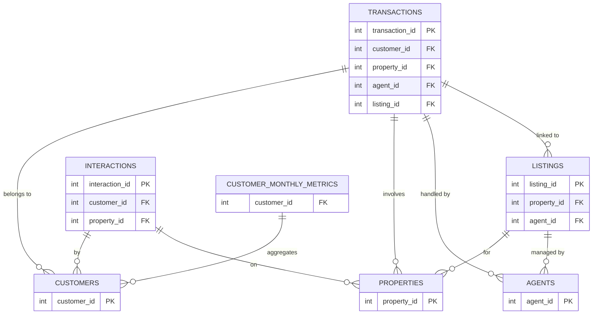

# 🏠 Real Estate Lakehouse Project

## 🚀 Project Overview

This project aims to build an **end-to-end Data Engineering pipeline** using:

* PySpark
* Delta Lake
* SQL
* Medallion Architecture (Bronze → Silver → Gold)

We will process a **Real Estate dataset (7 tables)** and generate business insights such as revenue trends, agent performance, and property demand.

---

# 📂 Repository Structure

```
realestate-lakehouse-project/
│
├── Data/              # Raw CSV files
├── Notebooks/         # Bronze, Silver, Gold notebooks
├── Scripts/           # Python scripts (Delta operations etc.)
├── Screenshots/       # Output screenshots
├── README.md
├── real_estate_project_plan.pdf
└── real_estate_dataset_summary.pdf
```

---

# 📌 What You Should Do FIRST (Day 1 Instructions)

Before touching any code, do the following:

## 1️⃣ Clone the Repository

```bash
git clone https://github.com/viveksadhucodes/realestate-lakehouse-project
cd realestate-lakehouse-project
```

---

## 2️⃣ Understand the Project (MANDATORY)

You are NOT allowed to start coding yet.

Read these two files carefully:

* 📄 `real_estate_project_plan.pdf` → Execution plan (Day 1–5)
* 📄 `real_estate_dataset_summary.pdf` → Dataset + schema details

---

## 3️⃣ What You Should Understand After Reading

### 🔹 Dataset Understanding

* 7 tables in total
* Main fact table → **transactions**

### 🔹 Key Join Columns

* customer_id
* property_id
* agent_id
* listing_id

---

### 🔹 Architecture Understanding

* Bronze → Raw data
* Silver → Cleaning + joins
* Gold → KPIs

---

### 🔹 Pipeline Flow

```
CSV → Bronze → Silver → Gold
```

---

# 🧩 ER Diagram (REFERENCE)

This ER diagram is already designed for the project.
Use this as the **single source of truth for all joins and relationships**.



---

## 4️⃣ Team Discussion (15–20 mins)

All members must:

* Confirm dataset
* Understand relationships using the ER diagram
* Clarify any confusion in joins before coding
* Agree naming conventions (snake_case)

---

## 5️⃣ Role Assignment (STRICT)

### 👤 Member 1 – Ingestion Engineer

* Bronze layer
* Load CSV files
* Add audit columns

### 👤 Member 2 – Transformation Engineer

* Silver layer
* Cleaning + joins
* MERGE + schema evolution

### 👤 Member 3 – Analytics Engineer

* Gold layer
* KPIs + SQL + window functions
* Documentation + PPT

---

## 6️⃣ Setup Databricks Environment

* Upload CSVs to:

  ```
  /volume/default/raw/
  ```

* Create folders:

  ```
  /raw/
  /bronze/
  /silver/
  /gold/
  ```

---

# ⚠️ Important Rules

* ❌ Do NOT start coding without understanding dataset
* ❌ Do NOT assume column names
* ❌ Do NOT ignore ER diagram
* ❌ Do NOT copy blindly

---

# 🧠 Goal of Day 1

* Dataset understanding
* ER diagram clarity
* Roles assigned
* Environment setup

---

# 🧨 Final Note

This project is NOT about writing code fast.
It is about building a **correct, explainable pipeline**.

If you don’t understand what you are doing,
you will get exposed during the viva.

---
