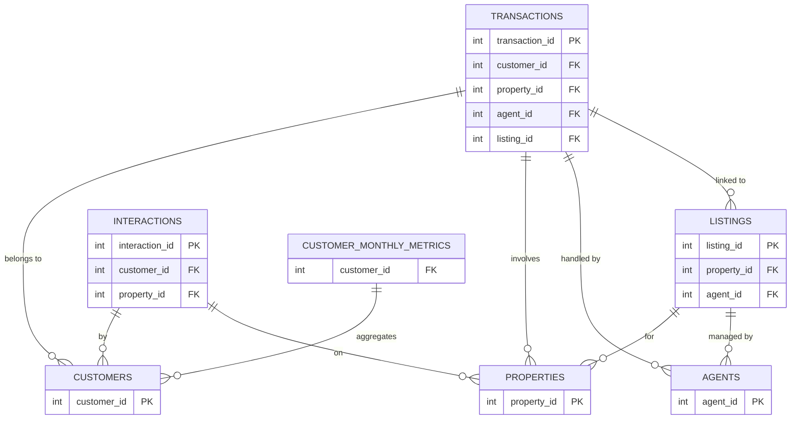

# 🏠 Real Estate Lakehouse Project

## 🚀 Project Overview

This project builds an **end-to-end Data Engineering pipeline** using:

* PySpark
* Delta Lake
* SQL
* Medallion Architecture (Bronze → Silver → Gold)

We process a **7-table Real Estate dataset** to generate insights like:

* Revenue trends
* Agent performance
* Property demand

---

# 📂 Project Structure (IMPORTANT)

```
realestate-lakehouse-project/
│
├── README.md
│
├── data/
│   └── raw/                     # All 7 CSV input files
│
├── notebooks/                   # Execution layer (Databricks)
│   ├── 01_bronze.ipynb
│   ├── 02_silver.ipynb
│   └── 03_gold.ipynb
│
├── pipeline/                    # Core logic (clean, modular code)
│   ├── bronze/
│   │   └── ingestion.py
│   ├── silver/
│   │   └── transformation.py
│   ├── gold/
│   │   └── analytics.py
│   └── utils/
│       └── common.py
│
├── sql/                         # SQL queries for KPIs
│   └── kpi_queries.sql
│
├── screenshots/                 # Output proof for submission
│
├── docs/                        # Reference documents
│   ├── real_estate_project_plan.pdf
│   └── real_estate_dataset_summary.pdf
│
└── scripts/
    └── solution.py
```

---

# 🧠 Why This Structure Exists

* Separates **data, logic, execution, and analytics**
* Aligns with **Medallion Architecture requirements** 
* Enables **clean team collaboration using Git** 

---

# 📌 Day 1 Instructions (MANDATORY)

## 1️⃣ Clone the Repository

```bash
git clone https://github.com/viveksadhucodes/realestate-lakehouse-project
cd realestate-lakehouse-project
```

---

## 2️⃣ Read Before Coding

Read:

* `docs/real_estate_project_plan.pdf`
* `docs/real_estate_dataset_summary.pdf`

These define:

* dataset structure
* join keys
* pipeline flow
* cleaning rules

If skipped:
👉 your joins WILL break later

---

## 3️⃣ Understand Core Concepts

### Dataset

* 7 tables
* Central fact table → **transactions**

### Keys

* customer_id
* property_id
* agent_id
* listing_id

### Pipeline Flow

```
CSV → Bronze → Silver → Gold
```

---

# 🧩 ER Diagram (SOURCE OF TRUTH)



---

# 👥 Team Responsibilities

| Member   | Role                    | Files                              |
| -------- | ----------------------- | ---------------------------------- |
| Member 1 | Bronze (Ingestion)      | pipeline/bronze, 01_bronze.ipynb   |
| Member 2 | Silver (Transformation) | pipeline/silver, 02_silver.ipynb   |
| Member 3 | Gold (Analytics)        | pipeline/gold, 03_gold.ipynb, sql/ |

---

# 🔄 Git Integration Workflow (USED IN THIS PROJECT)

Since Databricks Git integration is available, we follow a **direct Git workflow**.

---

## 🚀 Setup (One-Time)

In Databricks:

* New → **Git Folder**
* Paste repo URL
* Authenticate GitHub
* Clone repository

---

## 🔁 Daily Workflow

### 1️⃣ Pull Latest Code

```
git pull origin main
```

---

### 2️⃣ Work on Your Layer Only

* Do NOT modify other members’ files
* Stick to your assigned folder

---

### 3️⃣ Commit Changes

```
git add .
git commit -m "Silver: implemented cleaning and joins"
```

---

### 4️⃣ Push Changes

```
git push origin main
```

---

## ⚠️ Conflict Prevention

* Only ONE person edits a file at a time
* Always pull before starting work
* Push at end of session
* Use meaningful commit messages

---

# 🧠 Project Execution Plan (Aligned with 5-Day Plan)

* Day 1 → Setup + ER + roles
* Day 2 → Bronze layer
* Day 3 → Silver layer
* Day 4 → Gold KPIs + Delta features
* Day 5 → Full pipeline run + PPT

(Strictly follow plan) 

---

# ⚠️ Rules

* ❌ Do NOT assume column names
* ❌ Do NOT skip ER diagram
* ❌ Do NOT break pipeline for others
* ❌ Do NOT copy blindly

---

# 🧠 Goal of Day 1

* Dataset understanding
* ER diagram clarity
* Role assignment
* Databricks setup

---

# 🧨 Final Note

This project is not about writing code fast.

It is about:

* correct pipeline
* clean transformations
* clear explanation

If you don’t understand your own pipeline,
you will get exposed during the viva.

---
