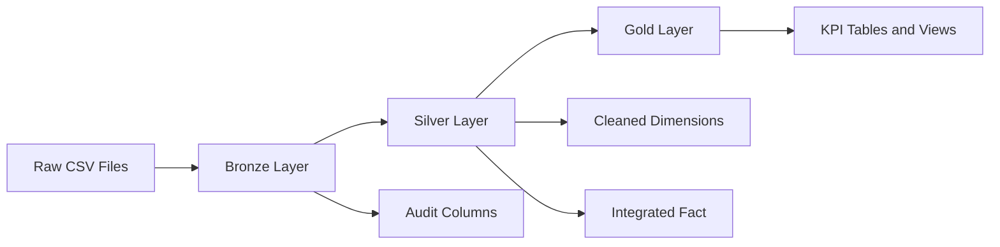
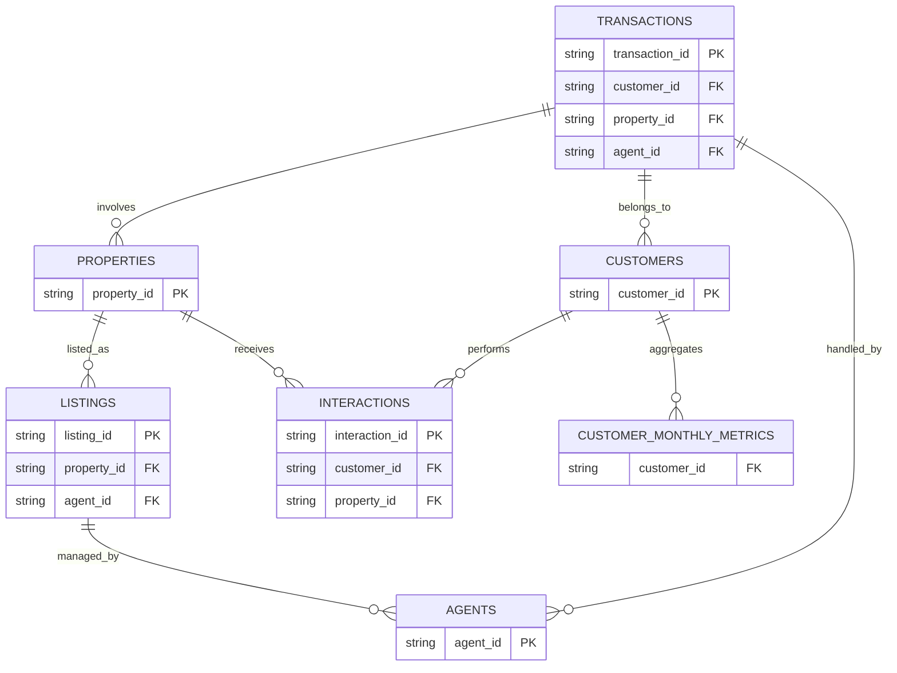

# Real Estate Lakehouse Project

<div align="center">

### End-to-End Medallion Data Pipeline (Bronze -> Silver -> Gold)

[](README.md)
[](README.md)
[](README.md)
[](README.md)

</div>

---

## Project Status

Project complete. The repository contains:

- Full Bronze ingestion pipeline
- Full Silver transformation and validation pipeline
- Full Gold analytics/KPI pipeline
- Executable notebooks for all three layers
- SQL KPI query file
- Layer-wise documentation

---

## Quick Navigation

- [Project Overview](#project-overview)
- [Final Repository Structure](#final-repository-structure)
- [Data Sources](#data-sources)
- [Architecture](#architecture)
- [Pipeline Implementation](#pipeline-implementation)
- [Notebook Flow](#notebook-flow)
- [KPI Outputs](#kpi-outputs)
- [How To Run](#how-to-run)
- [Tech Stack](#tech-stack)
- [Documentation Index](#documentation-index)
- [Team Responsibilities](#team-responsibilities)
- [References](#references)

---

## Project Overview

This project builds a production-style lakehouse workflow for a 7-table real estate dataset.

Data moves through the medallion model:

- Bronze: raw ingestion and audit metadata
- Silver: cleaning, standardization, deduplication, and fact build
- Gold: KPI modeling and analytics outputs

Business questions addressed include:

- Revenue trends across cities, categories, and time
- Agent performance and ranking
- Listing conversion and market speed
- Customer purchase behavior and segmentation

---

## Final Repository Structure

```text
realestate-lakehouse-project/
|
|-- Data/
|   |-- Raw/
|   |   |-- agents.csv
|   |   |-- customer_monthly_metrics.csv
|   |   |-- customers.csv
|   |   |-- interactions.csv
|   |   |-- listings.csv
|   |   |-- properties.csv
|   |   |-- transactions.csv
|
|-- docs/
|   |-- real_estate_dataset_summary.pdf
|   |-- real_estate_project_plan.pdf
|
|-- Notebooks/
|   |-- 01_bronze.ipynb
|   |-- 02_silver.ipynb
|   |-- 03_gold.ipynb
|
|-- pipeline/
|   |-- bronze/
|   |   |-- ingestion.py
|   |   |-- README.md
|   |-- silver/
|   |   |-- transformation.py
|   |   |-- README.md
|   |-- gold/
|   |   |-- analytics.py
|   |   |-- README.md
|
|-- sql/
|   |-- kpi_queries.sql
|
|-- README.md
```

---

## Data Sources

Raw input tables used:

- agents
- customers
- properties
- listings
- interactions
- transactions
- customer_monthly_metrics

Raw files are treated as source-of-truth and are stored in Data/Raw.

---

## Architecture



### Entity Relationship Snapshot



---

## Pipeline Implementation

### Bronze Layer

Implemented in pipeline/bronze/ingestion.py.

Key features:

- CSV ingestion for each source table
- Schema print and null analysis
- Optional duplicate check by primary key
- Audit columns:
  - ingestion_time
  - source_file
  - layer
- Delta write as bronze_<table_name>
- Row-count validation after write

Layer documentation: pipeline/bronze/README.md

### Silver Layer

Implemented in pipeline/silver/transformation.py and orchestrated in Notebooks/02_silver.ipynb.

Key features:

- Entity-level cleaning functions:
  - clean_transactions
  - clean_customers
  - clean_properties
  - clean_agents
  - clean_listings
- Standardization: trim/lowercase and category normalization
- Derived features: year_month, price_category, property_age, experience_level
- Controlled deduplication to prevent row explosion
- Integrated fact build via build_silver_fact
- Validation suite:
  - schema checks
  - null checks
  - duplicate checks
  - business-rule checks
  - join-integrity checks

Silver outputs:

- silver.silver_customers
- silver.silver_properties
- silver.silver_agents
- silver.silver_listings
- silver.silver_real_estate_fact

Layer documentation: pipeline/silver/README.md

### Gold Layer

Implemented in pipeline/gold/analytics.py and orchestrated in Notebooks/03_gold.ipynb.

Key features:

- KPI-focused transformations on Silver fact
- Window functions for ranking and cumulative metrics
- Demand, performance, conversion, and behavioral analytics

Sample KPI functions:

- revenue_by_city
- monthly_sales
- top_agents
- property_demand
- listing_conversion_rate
- commission_efficiency
- market_speed_analysis
- fastest_selling_category

Layer documentation: pipeline/gold/README.md

---

## Notebook Flow

Recommended execution sequence:

1. Run Notebooks/01_bronze.ipynb
2. Run Notebooks/02_silver.ipynb
3. Run Notebooks/03_gold.ipynb

This ensures all upstream tables are available before downstream logic runs.

---

## KPI Outputs

Gold layer KPIs are designed for dashboard consumption and stakeholder reporting.

Main KPI groups:

- Revenue and sales trend KPIs
- Agent performance and ranking KPIs
- Listing conversion and market speed KPIs
- Buyer behavior and premium segment KPIs

Additional SQL-based KPI logic can be maintained in sql/kpi_queries.sql.

---

## How To Run

### 1) Clone Repository

```bash
git clone https://github.com/viveksadhucodes/realestate-lakehouse-project
cd realestate-lakehouse-project
```

### 2) Load Environment

Use Databricks (or compatible Spark environment) with Delta support.

### 3) Execute Notebooks in Order

- Notebooks/01_bronze.ipynb
- Notebooks/02_silver.ipynb
- Notebooks/03_gold.ipynb

### 4) Verify Tables

Check Bronze, Silver, and Gold schema outputs and validation sections in the notebooks.

---

## Tech Stack

- PySpark
- Delta Lake
- SQL
- Databricks Notebooks
- Git/GitHub

---

## Documentation Index

- Root overview: README.md
- Bronze details: pipeline/bronze/README.md
- Silver details: pipeline/silver/README.md
- Gold details: pipeline/gold/README.md
- SQL KPIs: sql/kpi_queries.sql

---

## Team Responsibilities

| Member | Responsibility | Primary Assets |
|---|---|---|
| Member 1 | Bronze ingestion | pipeline/bronze, Notebooks/01_bronze.ipynb |
| Member 2 | Silver transformation | pipeline/silver, Notebooks/02_silver.ipynb |
| Member 3 | Gold analytics | pipeline/gold, Notebooks/03_gold.ipynb, sql/ |

---

## References

- docs/real_estate_project_plan.pdf
- docs/real_estate_dataset_summary.pdf

---

## Final Note

This project demonstrates the full lifecycle of a lakehouse pipeline:

- data ingestion reliability
- transformation quality and governance
- business-ready analytics

The repository is now organized as a complete, handover-ready implementation.
